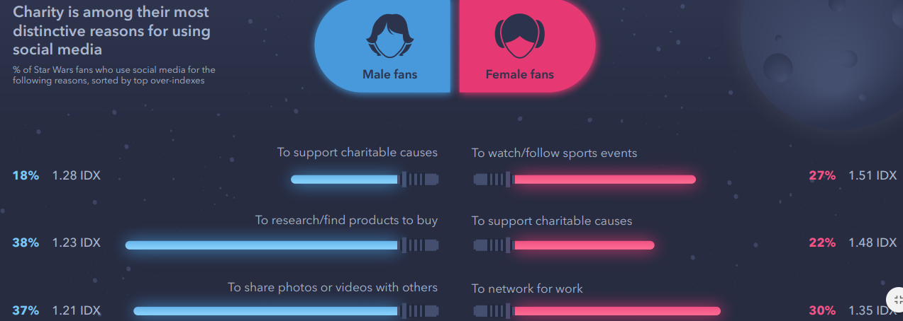
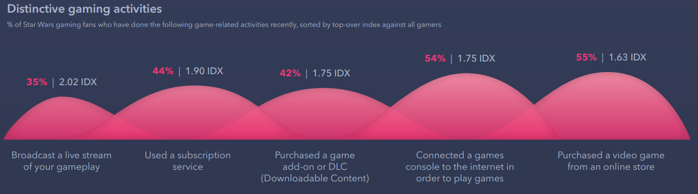

```{r setup, include=FALSE}
knitr::opts_chunk$set(echo = TRUE)
```

## Assessing Data Visualization examples
#  Good Example

I'll begin with my good example, which I found in a report published by GWI (Global Web Index), a market research company that publishes consumer insights reports. This particular report is about Star Wars fans, and their behaviors and preferences as consumers. 

I chose this example because our company presents similar survey data a lot, and it can be difficult to find a way to convey the most interesting information gleaned from a survey in a compelling way, because of the different factors involved, and the unstructured data involved in different questions/responses.

My first image is essentially a bar graph representing answers to why fans use social media. It splits answers between male and female, and only shows the top three answers for each group. It shows the percentage of Starwars fans who gave each response, and is sorted by IDX index (index versus the average internet user globally).

I thought this particular visualization does a great job of showing the difference between male and female respondents, and bringing forward their most prominent responses to the question. I also think the incorporation of the Star Wars theme into the visual is clever, and makes this report more interesting to read. 
 
image:



The bad example is from the same report, but this one displays gaming activities of fans, where each bubble represents the percent of Star Wars fans who have done each activity recently, sized by IDX.

My complaint about this visualization is that the overlap makes it confusing. It almost implies that there is some connection or overlap between the different curves (and the different responses) but I don't believe there is here. Also, it is all one color, and all of the curves are very similar in height. That makes it difficult to glean the important information from this visual.

image:


